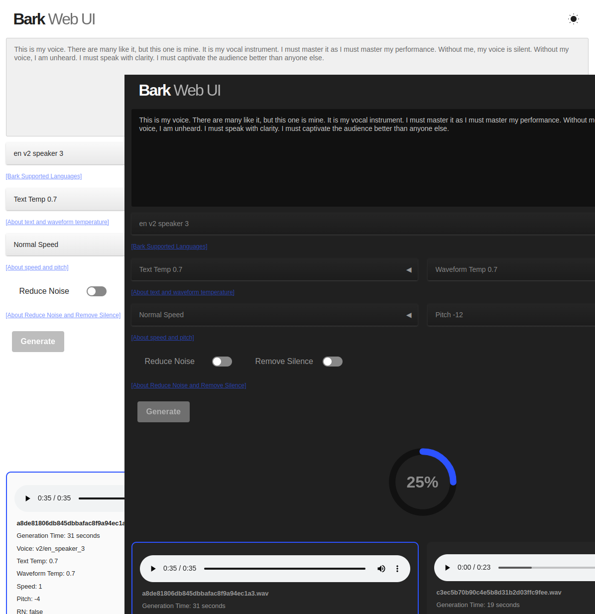

# Bark Web UI

This application is a Python Flask-based web UI designed to facilitate the generation of text-to-speech using [Suno AI's Bark](https://github.com/suno-ai/bark). It offers a variety of customisation options, including the ability to modify voice pitch, speed, and other parameters.

## Screenshot


## Sample audio
Some have pitch and speed adjustments applied.  


## Installation

1. Install Bark by following the instructions from the [Bark repository](https://github.com/suno-ai/bark).
1a. If you have not run bark before you will need to download the models, running a test will download and cache the required models (note models vary in size including one over 5GB in size).  
```terminal
python -m bark --text "Let's get this party started!" --output_filename "party.wav"
```
2. Once bark is running clone this repo into a directory called `webui` within the `bark` installation location. 
```Terminal
cd bark
git clone https://github.com/bradsec/barkwebui webui
```
3. Install any additional Python packages mentioned in the [requirements.txt](requirements.txt) file to meet the required imports in `app.py` and `bark_connector.py`. There will be shared imports already installed by the  Bark setup process. If applicable before installing imports activate the Python venv or conda/miniconda environment you are using for Bark.
4. Run the `python barkwebui_server.py` from within the `webui` folder to start the Flask web server application and a similar output should be displayed:
```terminal
 * Serving Flask app 'barkwebui_server'
 * Debug mode: on
WARNING: This is a development server. Do not use it in a production deployment. Use a production WSGI server instead.
 * Running on all addresses (0.0.0.0)
 * Running on http://127.0.0.1:5000
```
5. Access web application via browser address as shown in terminal window.

## Structure
- `barkwebui_server.py` provides the Flask web server functionality receives and returns information from the web interface and passes into `barkwebui_connector.py`. Also handles writing and deleting from of entries from the JSON dateset.

- `barkwebui_connector.py` breaks up text input before passing text to the Bark application. Also applies any audio effect selected like changes to speed, pitch, noise reductions and removing silence if selected. It will then write the `.wav` with unique filename to the `static/output` directory.

- `templates/index.html` the only HTML file used for the app. It will reference other files like css and JavaScript from the `static` directory.

- `static/js` - This directory contains two JavaScript for index.html template page.

  - `barkwebui.js` provides most of the page functionality and the link between `app.py` using [Socket.IO](https://socket.io/)
  - `populate.js` populates the select dropdown options in index.html.
  - `theme.js` for dark and light theme switching.

- `static/output` contains the completed wav audio files.
- `static/json` contains the `barkwebui.json` which contains information about any generated audio files.

<details>
<summary>Text Temperature</summary>
<br>
This parameter affects how the model generates speech from text. A higher text temperature value makes the model's output more random, while a lower text temperature value makes the model's output more deterministic. In other words, with a high text temperature, the model is more likely to generate unusual or unexpected speech from a given text prompt. On the other hand, with a low text temperature, the model is more likely to stick closely to the most probable output.
</details>
<details>
<summary>Waveform Temperature</summary>
<br>
This parameter affects how the model generates the final audio waveform. A higher waveform temperature value introduces more randomness into the audio output, which might result in more unusual sounds or voice modulations. A lower waveform temperature, on the other hand, makes the audio output more predictable and consistent.
</details>
<details>
<summary>Reduce Noise / Noise Reduction (NR)</summary>
<br>
Reduce background noise (not as good as an AI enhanced cleaner and often difficult to tell impact to audio given the randomness of each Bark generated speech even with same settings, it also can't remove echoing or AI hallucination). Code Ref (bark_connector.py): If value of 'reduce_noise' is True, it triggers noise reduction on the generated audio using the noisereduce library. reduce_noise takes the audio data and the sample rate as parameters and returns the audio with reduced noise. If reduce_noise is False, no noise reduction is applied, and the original audio is used.
</details>
  <details>
<summary>Remove Silence (RS)</summary>
<br>
Remove any extended pauses or silence (may not do much, was included for situations when generated voice contains long pauses for unknown reasons). Code Ref (bark_connector.py): If value of 'remove_silence' is True, it enables aggressive silence removal by setting the VAD (Voice Activity Detection) to level 3. The webrtcvad library is used for voice activity detection. If remove_silence is False, the VAD level is set to 0, which means no silence removal is applied. The sample rate also had to be reduced to 16000 from 24000 to get it to work with the webrtcvad library.
</details>
  <details>
<summary>Adjusting audio speed and pitch</summary>
<br>
Changes to speed and pitch may cause a fair amount of echo and reverb in the output audio. Running the audio through a third-party AI audio tool may help remove echo or reverb. A library called librosa is used for manipulating the audio speed and pitch. The speed of the audio is adjusted using the `librosa.effects.time_stretch` function, which stretches or compresses the audio by a certain factor. If the speed parameter passed into the `generate_voice` function is not 1.0 (i.e., the speed of the audio needs to be changed), the audio is time-stretched by the given rate. For instance, if the speed is 2, the audio's duration will be halved, making it play twice as fast. The pitch of the audio is adjusted using the `librosa.effects.pitch_shift` function. This function shifts the pitch of the audio by a certain number of half-steps. If the pitch parameter passed into the `generate_voice` function is not 0 (i.e., the pitch of the audio needs to be changed), the pitch of the audio is shifted by the given number of half-steps. For instance, if the pitch is 2, the pitch of the audio will be increased by 2 half-steps.
</details>
  
### Clearer Speech and Audio Results

**You will get cleaner speech and better results just generating without NR or RS checked and running through an AI-enhanced tool like [Adobe Podcast Enhance](https://podcast.adobe.com/enhance) or other similar tools.**
